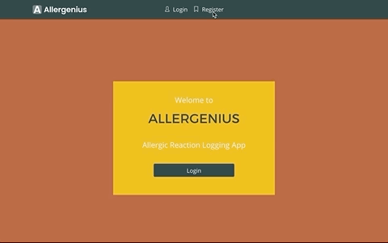

# allergenius

https://guarded-garden-65682.herokuapp.com/

## Contributors
- Erin Clancy
- Kayla Himmelberger
- Sarah Lopriore
- Nicholette Sams

## Intro
Allergenius is an app designed to help people experiencing allergic reaction to track their symptoms as well as the food they have consumed.  Users can then share this information with a healthcare professional in order to facilitate a diagnosis of what food(s) they are allergic to.

## Design Process
At the begining of our design process, we decided which features would be part of our MVP (most viable product) and which features would be part of Phase 2 or Phase 3 of development. Github Projects was used in order to create the tasks that all the team members worked on.  

## Individual Contributions
Although we all helped in all areas of the website, there were main focuses that each team member had:

- Erin: Authentication and styling.  
- Kayla: React components and pages and styling.  
- Sarah: Home page (including React calendar) and Reaction detail page. 
- Niki: backend MySQL schema, routes and Export to CSV. 

## Technologies
- HTML
- CSS
- Javascript
- Express
- Node
- React
- MySQL
- Axios
- bcrypt and JSON web tokens
- Github Projects

## Using the website
Visit https://guarded-garden-65682.herokuapp.com/ and register for an account.

### Adding a Reaction
Select "Add Reaction" from the navigation bar or click the "Add Reaction" button on the home page.  Fill out the form with the details about your reaction and click "Submit".

### Viewing your Reactions
Your reaction will then appear on the calendar on the home page after they have been added.  You can use the calendar to see a Month, Week or Day view.  You can click on the reactions in the calendar and see a detail view of your reaction.  On this screen you can also delete a reaction.

### Exporting your Reactions
On the Home page, click the button "Export Reactions to .CSV" to export all reactions entered to a comma delimited file.

### User Profile Information
Upon first registering, you will be taken to the profile page to fill out for the first time.  Your profile information can also be edited by clicking the "My Profile" link in the navigation bar.

## Future Development
- Add an option to export to (PDF).
- Add filtering options to the export so that users can choose a date range to export instead of exporting all.
- Add ability to upload a photo of your reaction.
- Add charts and graphs of reactions so user can see patterns.
- Add ability to delete your profile and user from the website.