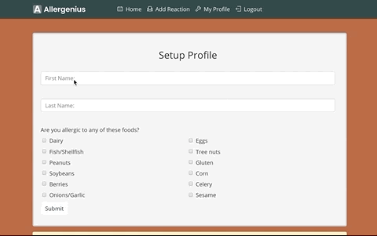
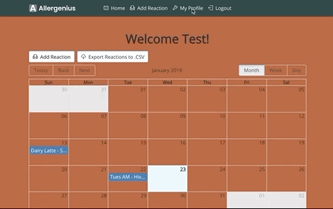
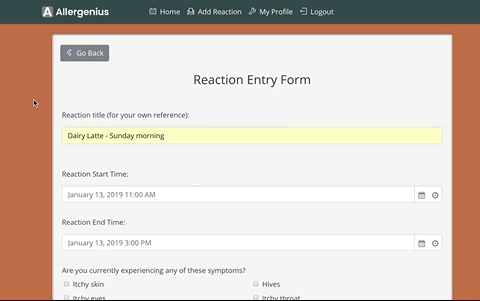
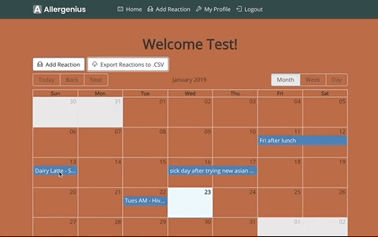
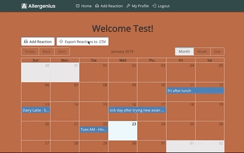

 

## Contributors
- [Erin Clancy](https://github.com/noplanetnoparty) 
- [Kayla Himmelberger](https://github.com/kaylahimmel)
- [Sarah Lopriore](https://github.com/sarahlopriore)
- [Nicholette Sams](https://github.com/nicholettesams)  

## Intro
[Allergenius](https://allergenius.herokuapp.com) is an app designed to help people experiencing allergic reaction to track their symptoms as well as the food they have consumed.  Users can then share this information with a healthcare professional in order to facilitate a diagnosis of what food(s) they are allergic to.  
  
## Design Process
At the begining of our design process, we decided which features would be part of our MVP (most viable product) and which features would be part of Phase 2 or Phase 3 of development. Github Projects was used in order to create the tasks that all the team members worked on.  
  
## Individual Contributions
Although we all helped in all areas of the website, there were main focuses that each team member had:

- Erin: User authentication, Heroku setup, debugging, and styling.  
- Kayla: React components and forms, documentation, debugging, and styling.  
- Sarah: React pages, implementing the reaction calendar, Heroku setup, and debugging. 
- Niki: backend MySQL schema, routes, documentation, debugging, and implementing export to CSV functionality.  
  
## Technologies Used
- [HTML5](developer.mozilla.org/en-US/docs/Web/Guide/HTML/HTML5)
- [CSS3](https://developer.mozilla.org/en-US/docs/Web/CSS)
- [Bootstrap](https://getbootstrap.com)
- [Javascript](https://www.javascript.com)
- [Express.js](https://expressjs.com)
- [Node.js](https://nodejs.org/en/docs)
- [React.js](https://reactjs.org)
- [Moment.js](http://momentjs.com)
- [MySQL](https://github.com/mysqljs/mysql#readme)
- [Sequelize](https://github.com/sequelize/sequelize#readme)
- [JSON Web Tokens](https://jwt.io)
- [Bcrypt package](https://github.com/kelektiv/node.bcrypt.js#readme)
- [Axios package](https://github.com/axios/axios) 
- [Express Router](https://github.com/mciparelli/express-router#readme)
- [Cors](https://github.com/expressjs/cors#readme)
- [BodyParser](https://github.com/expressjs/body-parser#readme)
- [DotEnv](https://github.com/motdotla/dotenv#readme)
- [Github Projects](https://help.github.com/articles/about-project-boards)  
  
## Using Allergenius

### Register and Sign In
Visit [Allergenius](https://allergenius.herokuapp.com) and register for an account. For authentication purposes, sign in immediately after registration is required.

  

### Setup Profile
After signing in, you will be automatically redirected to your profile setup page.  Add your name and any known food allergies.

  

### Edit Profile Information
After initial setup, you can update your profile information as needed by clicking the "My Profile" link in the navigation bar.

  

### Adding Reactions
Select "Add Reaction" from the navigation bar or click the "Add Reaction" button on the home page.  Fill out the form with the details about your reaction and click "Submit".

  

### Viewing Reactions
Once submitted, your reaction will then appear on the home page calendar.  Use the calendar to view reactions by month, week or day.  To view the details of a reaction, click on the reaction in the calendar.  If needed, you can delete the reaction, then click the "Back" button to return to the home page calendar.  Select "Home" from the navigation bar at any time to return to the home 

  

### Exporting Reactions
On the home page, click the "Export Reactions to .CSV" button to export all reactions entered to a comma delimited file. (For easiest viewing, open with Microsoft Excel, Google Sheets, Open Office Calc, or similar program.)

  
  
## Future Development
Our thoughts for future development include:
- adding the option to export reactions to PDF as well as CSV
- creating filter options so that users can choose a date range to export instead of exporting all reactions
- adding the ability to upload photos of reactions to be included in the exported file for the medical professionals
- building a graph of reactions so user can see patterns
- adding the option to edit reactions as well as delete them
- allowing the user to delete their profile and all data from the app
- adding educational tips and links in a resources section of the app
- changing logic so users can rate the severity of each type of reaction they're experiencing rather than give an overall severity rating
- incorporating sliding range bars rather than radio buttons for better UX